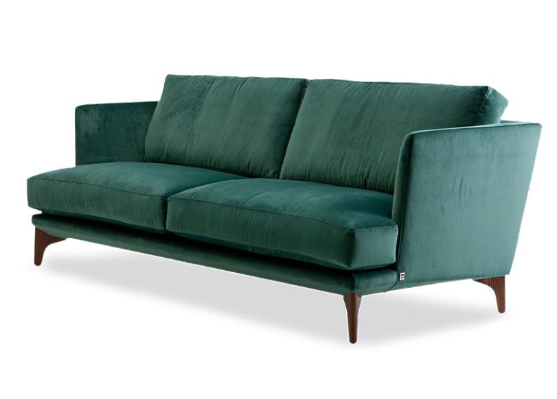

# Furni - Modern Interior Design Marketing Page

A sleek and responsive marketing landing page for Furni, a modern interior design studio. Built with **Vite** and **Tailwind CSS** for blazing-fast performance and beautiful, utility-first styling.


## 🎯 Features

- **Responsive Design** - Mobile-first approach with responsive layouts using Tailwind CSS
- **Fast Performance** - Built with Vite for instant HMR and optimized production builds
- **Modern Styling** - Utility-first CSS framework (Tailwind CSS) for rapid UI development
- **Interactive Elements** - Animated components with hover effects and smooth transitions
- **SEO Friendly** - Semantic HTML structure with proper meta tags
- **Easy to Customize** - Well-organized code structure for quick modifications

## 🛠️ Tech Stack

- **Vite** - Next generation frontend build tool
- **Tailwind CSS** - Utility-first CSS framework
- **HTML5** - Semantic markup
- **JavaScript (ES6+)** - Modern JavaScript for interactivity

## 📦 Installation

### Prerequisites
- Node.js (v14 or higher)
- npm or yarn

### Setup

1. **Clone or download the project**
   ```bash
   cd marketing-page
   ```

2. **Install dependencies**
   ```bash
   npm install
   ```

3. **Start the development server**
   ```bash
   npm run dev
   ```
   The page will open at `http://localhost:5173`

## 🚀 Available Scripts

| Command | Description |
|---------|-------------|
| `npm run dev` | Starts the development server with hot reload |
| `npm run build` | Builds the project for production |
| `npm run preview` | Previews the production build locally |

## 📁 Project Structure

```
marketing-page/
├── index.html              # Main HTML file
├── package.json            # Project dependencies
├── vite.config.js          # Vite configuration
├── Readme.md              # This file
├── public/                # Static assets (images, etc.)
│   └── ...
├── src/
│   ├── main.js            # Entry point
│   ├── counter.js         # JavaScript module
│   ├── style.css          # Global styles
│   └── assets/            # Project images and icons
│       └── couch.png
```

## 📄 Page Sections

The landing page includes the following sections:

- **Header** - Navigation bar with links and CTA button
- **Hero Section** - Compelling headline, description, and call-to-action
- **About** - Information about the design studio
- **Shop** - Featured furniture collections
- **Blog** - Latest articles and insights
- **Testimonials** - Customer reviews and feedback
- **Contact** - Contact information and inquiry form

## 🎨 Customization

### Colors
Tailwind CSS uses Emerald Green (`emerald-700`) as the primary color. Modify the Tailwind config or update the class names in HTML to change the color scheme.

### Content
Update the text, images, and links directly in `index.html` to match your branding.

### Styling
Add or modify styles using Tailwind CSS utility classes. For custom CSS, edit `src/style.css`.

## 🚀 Deployment

### Build for Production
```bash
npm run build
```
This creates an optimized build in the `dist` folder.

### Deploy
The `dist` folder is ready to be deployed to:
- Vercel
- Netlify
- GitHub Pages
- Any static hosting service

## 🖼️ Assets

Place your images and assets in the `public/` directory and reference them in your HTML:
```html

```

## ⚙️ Configuration

### Vite Config
Modify `vite.config.js` to customize build behavior:
```javascript
import { defineConfig } from 'vite'
import tailwindcss from '@tailwindcss/vite'

export default defineConfig({
  plugins: [tailwindcss()],
})
```

### Tailwind CSS
Configure Tailwind options in your `style.css` file using directives like:
- `@tailwind base;`
- `@tailwind components;`
- `@tailwind utilities;`


## 🤝 Contributing

Feel free to fork, modify, and use this project for your own purposes. Contributions and improvements are always welcome!

## 📝 License

This project is open source and available under the MIT License.

---    

**Built with ❤️ for modern web design**
